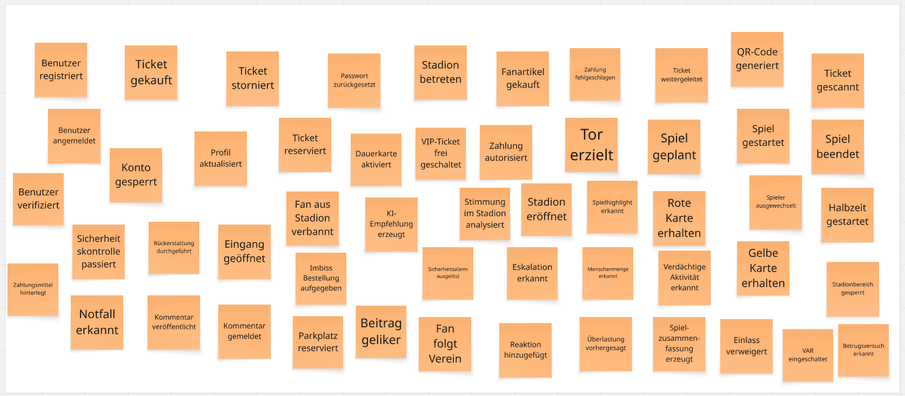
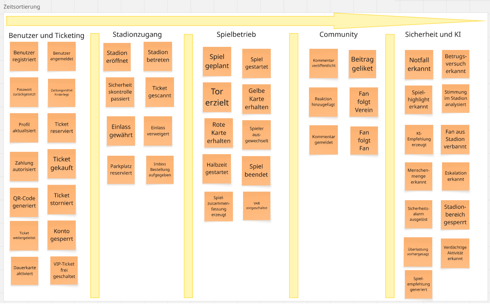
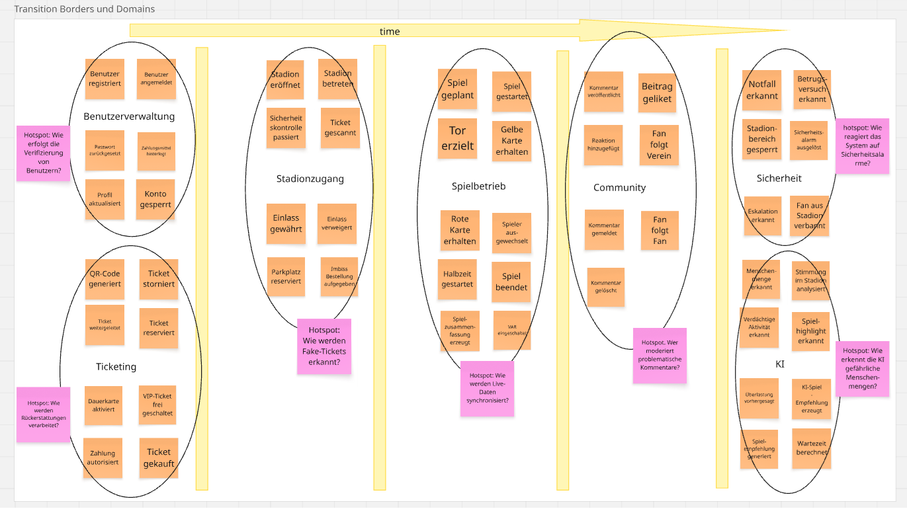
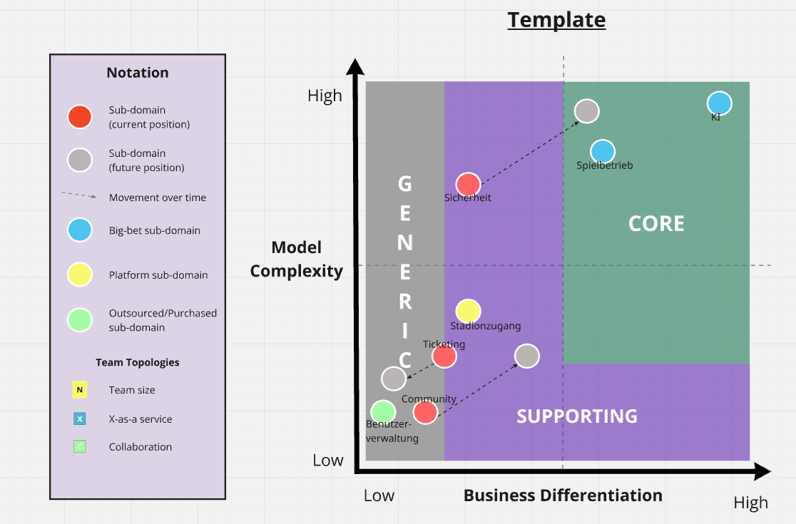
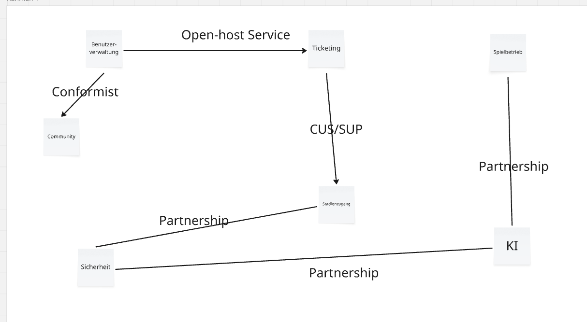
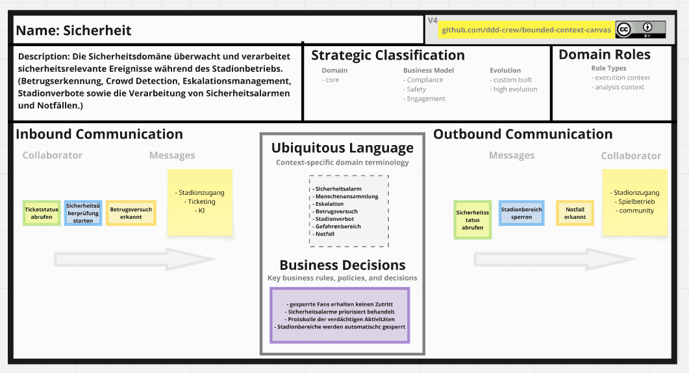

# Spieltag-PLUS

Spieltag PLUS ist eine digitale Plattform für Fußballvereine, Fans und Stadionbetreiber mit Funktionen für Ticketing, Community, Sicherheit, KI-Analysen und Spieltagsmanagement.
Alles in einem! 

## Inhalte

- OOD-E1 – Event Storming
- OOD-E2 – Core Domain Chart
- OOD-E3 – Domain Mapping
- OOD-E4 – Bounded Context Canvas

# OOD-E1 – Event Storming

## 1. Wildes Brainstorming

In der ersten Phase des Event Stormings habe ich fachliche Domain Events gesammelt.  
Die Events wurden zunächst unsortiert erfasst, um Prozesse, Abläufe und mögliche fachliche Zusammenhänge sichtbar zu machen.

Dabei wurden unterschiedliche Bereiche berücksichtigt:
- Ticketing
- Spielbetrieb
- Stadionbetrieb
- Sicherheit
- Community
- KI-gestützte Analysen

### Screenshot

---

## 2. Zeitliche Sortierung

In der zweiten Phase habe ich die Domain Events zeitlich sortiert.  
Dadurch wurden erste Prozessketten, fachliche Zusammenhänge und mögliche Domaingrenzen sichtbar.
Die zeitliche Sortierung stellt bei mir keine vollständig lineare Prozesskette dar.  
Es sind mehrere parallele fachliche Abläufe und Event-Ströme sichtbar vor allem bei den KI und Community-Prozessen.

Domains:
- Ticketing-Prozesse
- Stadionzugang
- Spielbetrieb
- Community-Funktionen
- Sicherheits- und KI-Prozesse

### Screenshot

---

## 3. Transition Borders & Domains

In der dritten Phase des Event Stormings habe ich einzelne Domains identifiziert:

- Benutzerverwaltung
- Ticketing
- Stadionzugang
- Spielbetrieb
- Community 
- Sicherheit
- KI 

Zusätzlich wurden Hotspots ergänzt, um offene Fragen, Risiken und Unsicherheiten innerhalb der Domain sichtbar zu machen.

-Verifizierung von Usern
- Erkennung gefälschter Tickets
- Rückerstattungen
- Moderation problematischer Kommentare
- Ki-Erkennung
- Verarbeitung von Sicherheitsvorfällen
- Synchronisieurng von Live-Daten
  

### Screenshot

# OOD-E2 – Core Domain Chart

Für Spieltag PLUS wurden die identifizierten Domains anhand von Business Differentiation ujd Model Complexity analysiert und eingeordnet.

## Core Domains

### Spielbetrieb
Der Spielbetrieb bildet das zentrale Herzstück der Plattform.  
Live-Spielereignisse, Echtzeitdaten und Spielanalysen erzeugen den größten fachlichen Mehrwert.

### KI 
KI-gestützte Analysen, Erkennung von Menschenansammlungen, personalisierte Empfehlungen etc. stellen ein wesentliches Unterscheidungsmerkmal gegenüber klassischen Plattformen dar.

---

## Supporting Domains

### Ticketing
Ticketing ist wichtig für die Plattform, stellt jedoch keine einzigartige Kernfunktion dar. Kann spter auch ausgesourced werden.

### Stadionzugang
Der Stadionzugang unterstützt den operativen Ablauf des Spieltags.

### Sicherheit
Umfasst KI-gestützte Stadionüberwachung, Menschenansammlungen, Betrugserkennung, Eskalationsmanagement und Notfallerkennung, somit hochkomplex. 
Fussballspiele ziehen immer mehr Massen an, Fans esklaieren mehr (Bengalos etc.), Sicherheit wird zukünftig in den Core reingehen, da es dadurch komplexer wird und alle Situationen bedacht werden müssen, was es einzigartiger macht.

---

## Generic Domains

### Benutzerverwaltung
Benutzerverwaltung ist eine Standardfunktion und könnte durch externe DL bereitgestellt werden.

### Community 
Die Community erhöht die Nutzerbindung, ist jedoch nur ergänzend zum eigentlichen Spieltagserlebnis.
Kann aber wachsen, je nachdem wie sich die Interaktion entwickeln. Es könnnten hier zukünftig neue Punkte wie reale Fantreffen etc. organisiert werden.

### Screenshot

## OOD-E3 – Domain Mappings

Für Spieltag PLUS wurden die identifizierten Domänen über Context Mapping miteinander verbunden.

Dabei wurden typische DDD-Relationships verwendet, um fachliche und technische Abhängigkeiten sichtbar zu machen.

## Beziehungen der Domains

### Benutzerverwaltung → Ticketing
**Relationship:** Open Host Service

Die Benutzerverwaltung stellt standardisierte Authentifizierungs- und Benutzerinformationen bereit, die vom Ticketing-System genutzt werden.

---

### Benutzerverwaltung → Community
**Relationship:** Conformist

Die Community-Domäne übernimmt Benutzerinformationen und Rollenmodelle der Benutzerverwaltung und passt sich an diese an.

---

### Ticketing → Stadionzugang
**Relationship:** Customer / Supplier

Das Ticketing-System liefert Ticket- und Reservierungsdaten an den Stadionzugang, der diese Informationen zur Einlasskontrolle verwendet.

---

### Stadionzugang ↔ Sicherheit
**Relationship:** Partnership

Stadionzugang und Sicherheitsdmain arbeiten eng zusammen, beispielsweise bei Sperrungen oder Sicherheitsvorfällen im Stadionbetrieb.

---

### Spielbetrieb ↔ KI
**Relationship:** Partnership

Die KI-Domäne analysiert Live-Spielereignisse und verarbeitet Echtzeitdaten des Spielbetriebs, um Analysen und Empfehlungen an User zu erzeugen.

---

### Sicherheit ↔ KI
**Relationship:** Partnership

KI-gestützte Sicherheitsanalysen unterstützen die Erkennung von Eskalationen, Betrugsversuchen oder Notfällen im Stadion.

---

## Domain Mapping Diagramm

## OOD-E4 – Bounded Context Canvas

